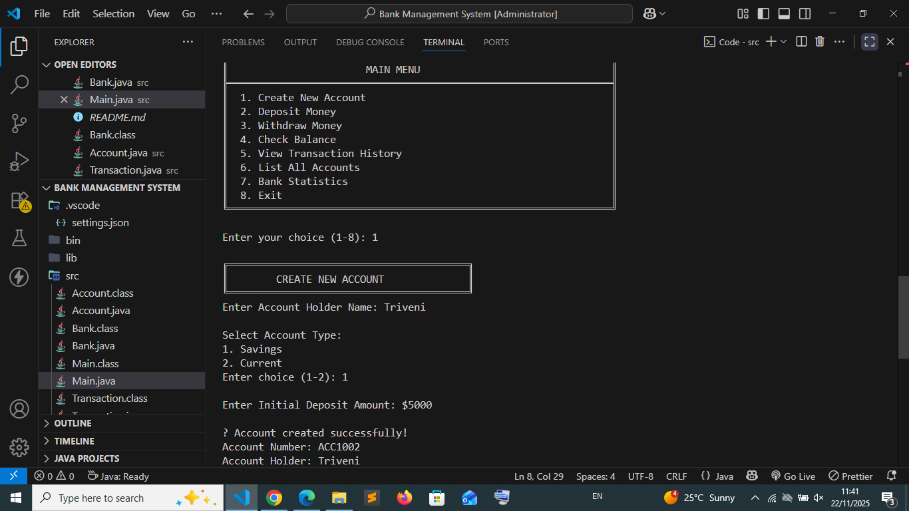
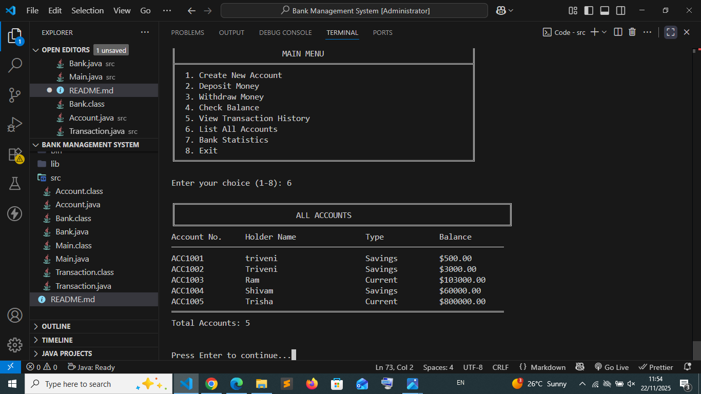
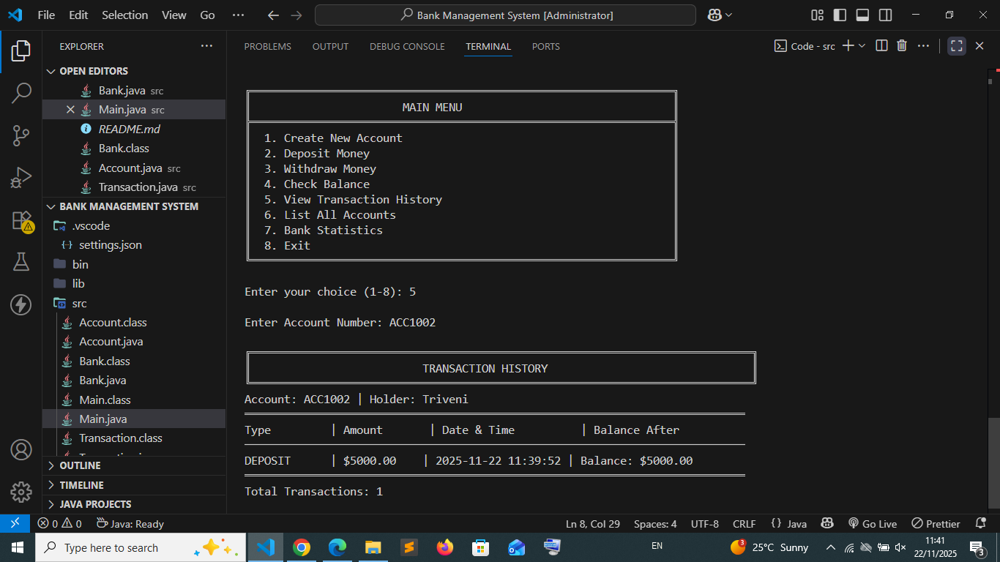

# 🏦 Digital Banking System

A comprehensive console-based banking application developed in Java using Object-Oriented Programming principles. This project demonstrates core banking operations with a clean, user-friendly interface and robust data management.


## 📋 Table of Contents
- [Features](#features)
- [Technologies Used](#technologies-used)
- [Project Structure](#project-structure)
- [Installation](#installation)
- [Usage](#usage)
- [Core Functionalities](#core-functionalities)
- [Class Structure](#class-structure)
- [Screenshots](#screenshots)
- [Future Enhancements](#future-enhancements)
- [Contributing](#contributing)
- [License](#license)
- [Contact](#contact)

## ✨ Features

- **Account Management**
  - Create new bank accounts (Savings/Current)
  - Automatic account number generation
  - Store account holder information

- **Transaction Operations**
  - Deposit money with validation
  - Withdraw money with balance checking
  - Real-time balance updates

- **Information Services**
  - Check account balance
  - View detailed transaction history
  - List all accounts in the system
  - View bank-wide statistics

- **Data Management**
  - ArrayList-based data storage
  - Transaction history tracking with timestamps
  - Comprehensive input validation

- **User Interface**
  - Clean menu-driven interface
  - Formatted output with boxes and tables
  - Error handling and user feedback

## 🛠️ Technologies Used

- **Language:** Java (JDK 8 or higher)
- **Concepts:** 
  - Object-Oriented Programming (OOP)
  - Encapsulation
  - Abstraction
  - ArrayList Collections
  - Exception Handling
  - Input Validation
- **IDE:** Any Java IDE (Eclipse, IntelliJ IDEA, VS Code, NetBeans)

## 📁 Project Structure

```
BankingApplication/
│
├── src/
│   ├── Main.java              # Entry point with menu interface
│   ├── Bank.java              # Bank management and operations
│   ├── Account.java           # Account class with core banking features
│   └── Transaction.java       # Transaction record management
│
│
├── screenshots/
│   ├── main_menu.png
│   ├── account_creation.png
│   ├── transactions.png
│   └── history.png
├   ├── withdraw.png
│   └── deposite.png
├   └── check_balance.png
│
├── .gitignore
├── README.md
```

## 🚀 Installation

### Prerequisites
- Java Development Kit (JDK) 8 or higher
- Command line interface (Terminal/Command Prompt)
- (Optional) Java IDE

### Steps

1. **Clone the repository**
   ```bash
   git clone https://github.com/yourusername/banking-application.git
   cd banking-application
   ```

2. **Navigate to source directory**
   ```bash
   cd src
   ```

3. **Compile the Java files**
   ```bash
   javac *.java
   ```

4. **Run the application**
   ```bash
   java Main
   ```

### Using an IDE

1. Open your Java IDE
2. Import the project as a Java project
3. Ensure all `.java` files are in the source folder
4. Run `Main.java`

## 💻 Usage

### Starting the Application

Run the `Main.java` file, and you'll see the welcome banner and main menu:

```
╔════════════════════════════════════════════════════════════════╗
║                                                                ║
║          WELCOME TO DIGITAL BANKING SYSTEM                     ║
║                                                                ║
╚════════════════════════════════════════════════════════════════╝
```

### Main Menu Options

1. **Create New Account** - Register a new bank account
2. **Deposit Money** - Add funds to an existing account
3. **Withdraw Money** - Withdraw funds from an account
4. **Check Balance** - View current account balance
5. **View Transaction History** - See all past transactions
6. **List All Accounts** - Display all registered accounts
7. **Bank Statistics** - View system-wide statistics
8. **Exit** - Close the application

### Example Workflow

1. Create a new account with initial deposit
2. Note your account number (e.g., ACC1001)
3. Perform deposits or withdrawals using your account number
4. Check balance and transaction history anytime

## 🔧 Core Functionalities

### 1. Account Creation
- Input validation for name and deposit amount
- Choice between Savings and Current account types
- Automatic unique account number generation
- Initial deposit recording

### 2. Deposit Operation
- Positive amount validation
- Balance update
- Transaction recording with timestamp

### 3. Withdrawal Operation
- Positive amount validation
- Sufficient balance checking
- Balance update
- Transaction recording

### 4. Balance Inquiry
- Display current balance
- Show account details
- Formatted output

### 5. Transaction History
- Chronological transaction list
- Transaction type, amount, date, and balance after transaction
- Total transaction count

## 🏗️ Class Structure

### Main.java
- Application entry point
- Menu display and user interaction
- Input handling and navigation

### Bank.java
- Manages ArrayList of accounts
- Implements banking operations
- Account lookup functionality
- Input validation utilities

### Account.java
- Account properties (number, holder name, type, balance)
- Deposit and withdrawal methods
- Balance inquiry
- Transaction history management

### Transaction.java
- Transaction properties (type, amount, timestamp, balance)
- Formatted transaction display
- Timestamp management using LocalDateTime

## 📸 Screenshots

### Main Menu


### Account Creation


### Transactions


### Transaction History


## 🔮 Future Enhancements

- [ ] File-based data persistence (save/load from files)
- [ ] User authentication with PIN/password
- [ ] Fund transfer between accounts
- [ ] Account closure functionality
- [ ] Interest calculation for savings accounts
- [ ] Monthly statements generation
- [ ] GUI interface using JavaFX/Swing
- [ ] Database integration (MySQL/PostgreSQL)
- [ ] Multi-currency support
- [ ] Loan and credit card management
